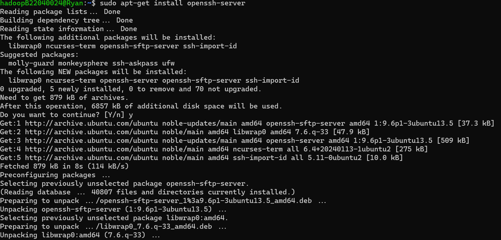
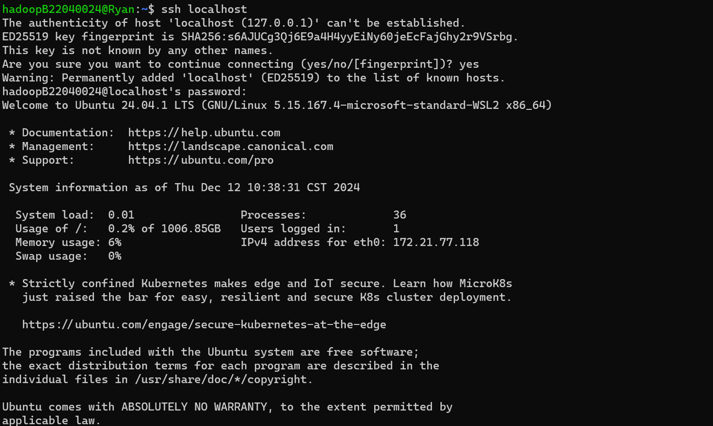
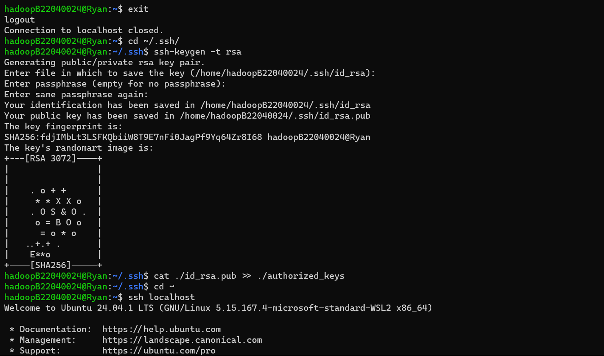
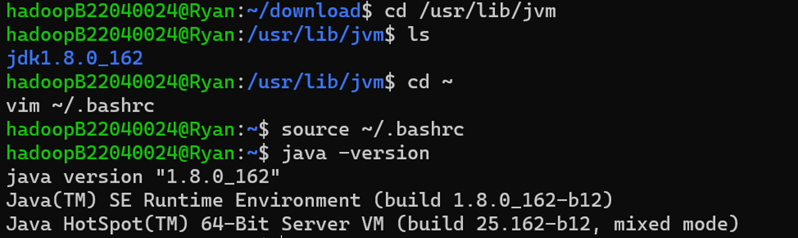
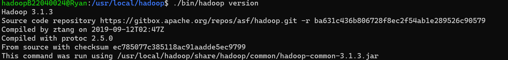
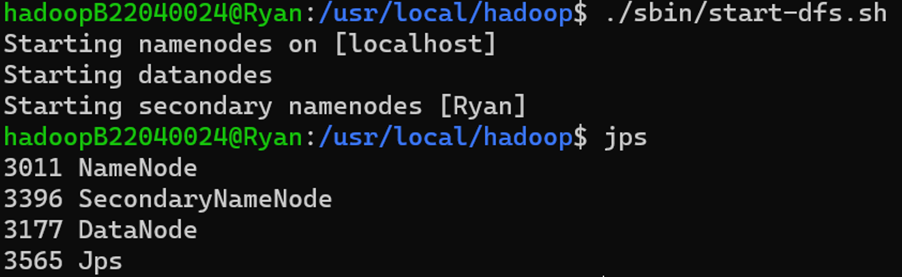
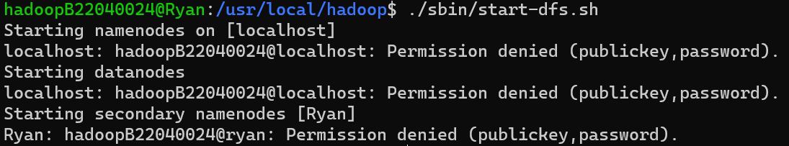
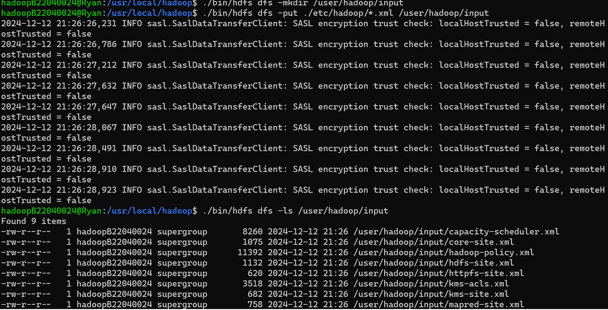
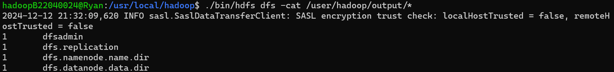

# 实验1：熟悉常用的Linux操作和Hadoop操作

本文记录了大数据挖掘课程中实验1的步骤和遇到的问题。本文基于该[参考教程](https://dblab.xmu.edu.cn/blog/2441/)。

## 创建Hadoop用户

在root用户下创建新用户hadoopB22040024，授予root权限并切换至该用户

```shell
sudo useradd -m hadoopB22040024 -s /bin/bash
sudo adduser hadoopB22040024 sudo
su – hadoopB22040024
sudo apt-get install openssh-server
```

## 安装并配置环境

安装ssh-server

```shell
sudo apt-get install openssh-server
```



连接localhost

```shell
ssh localhost
```



设置无需密码连接

```shell
exit
cd ~/.ssh
ssh-keygen -t rsa
cat ./id_rsa.pub >> ./authorized_keys
cd ~
ssh localhost
```



安装jdk1.8

假设压缩包在`~/download`目录下

```shell
cd /usr/lib
sudo mkdir jvm
cd ~
cd download
sudo tar -zxvf ./jdk-8u162-linux-x64.tar.gz -C /usr/lib/jvm
cd /usr/lib/jvm
ls
cd ~
vim ~/.bashrc
```

在文件开头增加以下几行内容

```
export JAVA_HOME=/usr/lib/jvm/jdk1.8.0_162
export JRE_HOME=${JAVA_HOME}/jre
export CLASSPATH=.:${JAVA_HOME}/lib:${JRE_HOME}/lib
export PATH=${JAVA_HOME}/bin:$PATH
```

输入`:wq`保存并退出

```shell
source ~/.bashrc
java -version
```



解压安装Hadoop

假设压缩包在`~download`目录下

```shell
sudo tar -zxf ~/download/hadoop-3.1.3.tar.gz -C /usr/local
cd /usr/local/
sudo mv ./hadoop-3.1.3/ ./hadoop
sudo chown -R hadoop ./hadoop
cd /usr/local/hadoop
./bin/hadoop version
```



## Hadoop单机配置（非伪分布式）

```shell
cd /usr/local/hadoop
mkdir ./input
cp ./etc/hadoop/*.xml ./input
./bin/hadoop jar ./share/hadoop/mapreduce/hadoop-mapreduce-examples-3.1.3.jar grep ./input ./output 'dfs[a-z.]+'
cat ./output/*
```


## Hadoop伪分布式安装

Hadoop 的配置文件位于 /usr/local/hadoop/etc/hadoop/ 中，伪分布式需要修改2个配置文件`core-site.xml`和`hdfs-site.xml` 。

修改配置文件`core-site.xml`

```
<configuration>
</configuration>
```

->

```
<configuration>
    <property>
        <name>hadoop.tmp.dir</name>
        <value>file:/usr/local/hadoop/tmp</value>
        <description>Abase for other temporary directories.</description>
    </property>
    <property>
        <name>fs.defaultFS</name>
        <value>hdfs://localhost:9000</value>
    </property>
</configuration>
```

修改`hdfs-site.xml`

```
<configuration>
</configuration>
```

->

```
<configuration>
    <property>
        <name>dfs.replication</name>
        <value>1</value>
    </property>
    <property>
        <name>dfs.namenode.name.dir</name>
        <value>file:/usr/local/hadoop/tmp/dfs/name</value>
    </property>
    <property>
        <name>dfs.datanode.data.dir</name>
        <value>file:/usr/local/hadoop/tmp/dfs/data</value>
    </property>
</configuration>
```

执行NameNode格式化

```
cd /usr/local/hadoop
./bin/hdfs namenode -format
```


开启NameNode和DataNode守护进程

```shell
cd /usr/local/hadoop
./sbin/start-dfs.sh
```



我在运行时发生以下报错



由于我是使用WSL进行实验，而在Windows系统下下载安装包并直接将安装包复制进Linux系统中，为了实现这一目标，我通过以下命令修改权限：

```shell
chmod 777 ~
```

所以导致在使用`ssh localhost`命令的时候依然需要输入密码导致开启失败，使用以下命令修改后解决问题：

```shell
chmod 700 ~
```

## 运行Hadoop伪分布式实例

在HDFS中创建目录

```shell
./bin/hdfs dfs -mkdir -p /user/hadoop
```

将`./etc/hadoop`中的xml文件作为输入文件复制到分布式文件系统中，即将`/usr/local/hadoop/etc/hadoop`复制到分布式文件系统中的`/user/hadoop/input`中

原教程此处使用相对路径，但是实际操作发现会报错，加入`-p`参数后因当前目录未切换，创建的目录存在问题，因此以下统一修改为绝对目录

```shell
./bin/hdfs dfs -mkdir /user/hadoop/input
./bin/hdfs dfs -put ./etc/hadoop/*.xml /user/hadoop/input
```



运行伪分布式MapReduce并查看运行结果

```shell
./bin/hadoop jar ./share/hadoop/mapreduce/hadoop-mapreduce-examples-3.1.3.jar grep /user/hadoop/input /user/hadoop/output 'dfs[a-z.]+'
```



关闭Hadoop

```shell
./sbin/stop-dfs.sh
```

