# [회고] 중동 시장 진출을 위한 인프라 구축 프로젝트

CJ Cloud Wave 교육에서 실시한 프로젝트입니다. <br>
주어진 기본 시나리오에 각 팀만의 시나리오를 추가하여 진행하였습니다. 
또한 프로젝트에서 요구되는 요구 사항을 수행하며 필요에 따라 발전시키는 방향으로 구축을 진행하였습니다. <br>
먼저, 주어진 기본 시나리오는 다음과 같습니다.

```txt
CJ 올리브 네트웍스에서 창의적이고 주도적인 인재를 대거 영입하면서 신규 프로젝트를 추진하려 합니다. 
신규 프로벡트 사업은 클라우드를 도입하여 클라우드 네이티브 기반의 개발 환경과 운영 환경을 갖추게 될 것입니다. 
이제 여러분은 신규 개발을 수행할 개발자 분들을 위해 개발 및 테스트 그리고 운영 환경을 갖춘 클라우드 환경을 구성해 주시기 바랍니다.
```

그리고 프로젝트에서 주어진 **요구 사항**은 다음과 같습니다
```txt
1. 시스템 인프라를 구성하고 각종 플랫폼 서비스와 소프트웨어 서비스를 선택하여 구성합니다.
2. 마이크로 서비스 환경을 위해 서비스는 컨테이너로 배포합니다. 혹은 컨테이너로 배포되는 서비스가 하나 이상이 되어야 합니다.
3. 데이터베이스와 스토리지 기술을 하나 이상 사용해야 합니다.
4. 지연 시간이 최소화될 수 있는 성능을 보장하도록 구성합니다.
5. 보안적으로 안전하도록 구성합니다.
6. 신뢰할 수 있는 서비스가 되도록 안정성이 높아야 합니다.
7. 비용 효율성이 높고 최적화가 잘 되어 있어야 합니다.
8. 개발자를 위한 테스트 환경을 구성하고, 콘텐츠를 운영 환경으로 전달할 수 있는 프로세스가 필요합니다. 
9. 자동화 도구들을 통해 관리 위험을 줄이고 빠른 대응이 가능하도록 구성합니다.
※ 모든 항목 구성 시에 왜 그렇게 구성을 했는지에 대해서 이유를 충분하게 고민해 보시기 바랍니다.
```

위 기본 사항을 숙지한 후 우리 팀만의 **시나리오**를 추가한 결과는 다음과 같았습니다.

> CJ 올리브영의 **중동 시장 진출 확대**를 위해 **현지 시장에 맞춘 올리브영 인프라**를 구축하고자 합니다. 

<br>
즉, 프로젝트의 내용은 다음과 같습니다.

1) 올리브영의 중동 시장 진출 확대를 위해 새로운 웹사이트를 구축하고
2) 신규 개발자들이 해당 프로젝트에 투입되는 상황에서
3) 실시간 중동 고객 구매 패턴을 파악할 수 있도록 파이프라인을 설계

<br>

또한 이 프로젝트를 수행하기 위한 **인프라 도입의 과제**는 다음과 같습니다.
- 안정적인 인프라 구성
- 특정기간(올영세일)에 몰리는 대규모 트래픽에 대응
- 서비스의 안정적 운영을 위한 CICD, 모니터링 그리고 비용 최적화
- 실시간으로 고객 구매 행동 로그를 수집하고 모니터링할 수 있는 파이프라인 구현

## 하필 "*중동 시장*" 인 이유?

하필 중동 시장으로 프로젝트의 주제를 정한 부분에 대해 궁금해하실 분들이 계실 것 같습니다. 실제로 이 부분에 대해 프레젠테이션 할 때에도 신경을 많이 썼는데요. 팀원들과 함께 조사한 결과 머니파워가 센 중동시장이 가진 뷰티산업의 잠재력에 주목했습니다. 현재 중동시장은 히잡을 벗고 자신을 드러내려는 기조가 확산되며 중동 여성들의 사회적 지위 향상 및 소비 파워가 증가하는 추세입니다. 또한 이러한 소비 경향과 K 뷰티의 인기 증가가 맞물려 작년 2월부터 올리브영 또한 중동시장 진출 확대에 힘쓰고 있습니다. 그러나 전 세계를 대상으로 하는 기존 인프라 환경에서는 특정 국가를 대상으로 한 맞춤 전략을 짜기 어렵고 중동 사용자 데이터를 효과적으로 수집하기에도 적합하진 않았습니다. 이에 주목한 우리 팀은 중동 시장을 키워드로 잡은 시나리오를 설계한 것이죠.


### 전체 아키텍처 설계
세부사항을 다루기에 앞서, 설계한 전체 아키텍처의 모습입니다. 시나리오를 정한 후 아키텍처 설계를 진행했는데요. AWS에서 사소한 하나의 기능을 사용하는 것에도 모두 왜 사용해야 했는지에 대한 당위성을 찾고 비슷한 기능들 중 더 적합한 것을 찾기 위해 고민하는 시간이 길었습니다. 이 때문에 아키텍처 설계에 꽤 많은 시간을 들여야 했고 공을 많이 들였던 것 같아요. 그렇게 설계된 최종 모습이 다음과 같습니다.


### 프론트엔드
웹페이지 즉, 사용자가 올리브영의 상품을 구매하기 위해 접근하는 사이트는 아키텍처를 통해 알 수 있다시피 다음과 같은 형태로 구성했습니다.
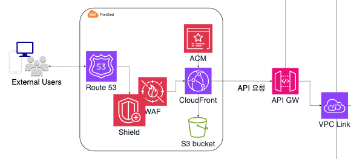
우선 지연 시간 최소화와 접근 편의성을 위하여 Route53과 CloudFront를 통해 접속하도록 구성했습니다. 또한 이때 보안적으로 안전하도록 WAF, Shield, 그리고 ACM을 사용하여 구성했습니다.  사용자가 보낸 구매 요청이 API Gateway를 통해 들어오면 VPC Link와 NLB를 거쳐 API 요청이 안전하게 처리될 수 있도록 설계했습니다.

### 백엔드
다음은 백엔드 기반 아키텍처의 모습입니다. 앞서 웹페이지를 통해 NLB까지 들어온 API 요청은 EKS에 기반하여 처리됩니다. 
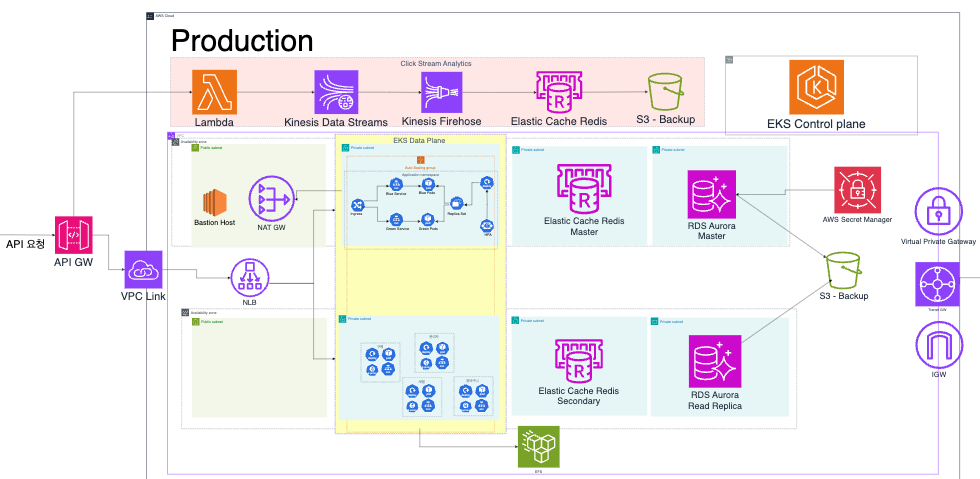
백엔드 파트 구축하며 처음에는 Fargate를 사용했었습니다. 그러나 Fargate 구축 후 다른 기능 사항을 구축하는 과정에서 몇 가지 제약들이 있었습니다. 예를 들면 Deamonset 불가 등이 그 이유입니다. 몇 번의 시행착오 끝에 결국 Fargate를 제외하고 EKS로만 구성하는 방향으로 변경하였습니다. 같이 백엔드 파트 구축했던 팀원분들과 고생을 많이 했었는데 끝내 사용하지 못했어서 아쉬움이 조금 남네요.

### 안정적인 EKS 구축 방안
주어진 요구 사항을 위하여 안정성을 고려해야 했습니다. 안정적으로 EKS를 구축하기 위한 방안에는 무엇이 있는지 팀원들과 많이 고민했었습니다. 오랜 고민과 선별 끝에 다음과 같은 것들을 선정했습니다.

- 자가복구 - 오류에도 애플리케이션 안정성 유지
- 영향범위 최소화 - 장애 발생 시에도 중요 워크로드의 안정성 유지
- 빠른 확장 - 대규모 트래픽에도 안정성 유지

첫째로, 자가 복구를 위해서는 Probe를 채택했었습니다. LivenessProbe, ReadinessProbe를 사용하여 지속적으로 상태를 체크하도록 했습니다. 기본 설계 구축에 사용했던 테라폼 코드에 Probe 어노테이션을 추가하기만 하면 되니 어렵지 않게 사용 가능하죠. 
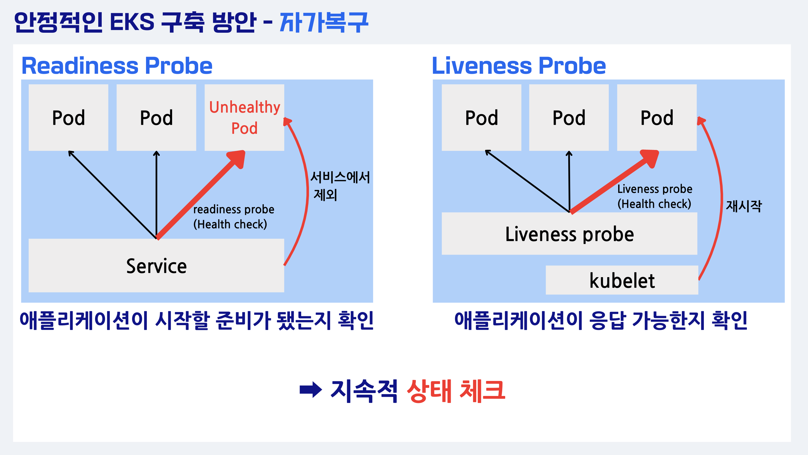
위 그림은 자가복구 방안 기능에 대하여 설명하기 위해 제가 만들었던 화면인데요. 프레젠테이션 자료에 넣기 위해 열심히 만들었는데 흐름 상 제외하게 되어 아쉬움이 남아 가져왔네요.😅 혹시나 Probe에 대해 잘 모르셨던 분들이 있다면 그림이 이해에 조금이나마 도움이 되었으면 좋겠습니다. 
 
둘째로, 영향 범위 최소화를 위한  Pod Anti-Affinity입니다. 이를 사용하면 파드를 고르게 배치할 수 있는데요. 만약 동일한 노드에 같은 파드가 배치된다면 노드 과중으로 인해 서비스 다운이 발생하게 됩니다. 파드 안티 어피니티를 설정해 놓으면 이미 동일한 파드가 떠있는 곳에는 배치되지 않도록 구성하여 영향 범위가 최소화되며 해당 현상을 방지할 수 있습니다. 

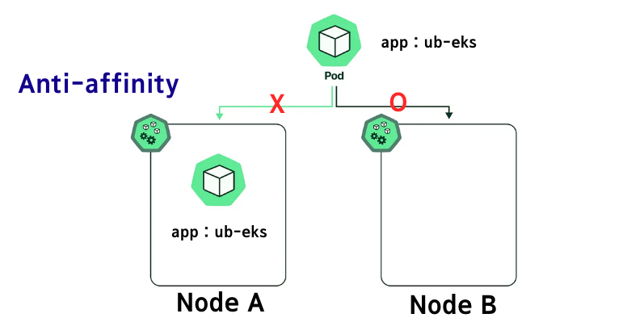

다음으로는 대규모 트래픽에도 안정성을 유지하기 위한 빠른 확장 방안입니다. 이 경우 HPA와 Karpenter를 이용했는데요. HPA를 통해 pod autoscaling을 구현하고 Karpenter를 이용하여 node autoscaling을 구현했습니다. 파드 오토스케일링의 경우 HPA와 VPA 사이에서 고민하다가 최종적으로 HPA를 채택했습니다. vertical 한 VPA와 달리 HPA는 horizontal 하므로 다음과 같은 장점들이 있기 때문입니다.

1) stateless 애플리케이션에 적합하다.
2) scale out에 용이하다.
3) 구현에 용이하다.

우리 팀의 애플리케이션 역시 빠른 기동이 필요한 stateless application이었습니다. 따라서 stateful 동작에 적합한 VPA 보다는 HPA 가 적합하다고 생각해 적용했습니다. 
 
노드 오토스케일링의 경우 CA와 Karpenter 중 고민하다가 최종적으로 Karpenter를 선택하게 되었는데요. 이는 다음과 같은 장점이 있었기 때문입니다. 우선 CA에 비해 Karpenter는 Node Group이 필요하지 않고 약 1 ~ 2분 정도 빠르게 노드 프로비저닝이 가능합니다. 이때 사용자가 프로비저닝 되는 노드는 사용자가 정의한 노드의 사양 안에서 가장 비용 효율적인 노드로 자동 선택됩니다. 즉, 비용 효율적이고 운영 복잡도가 감소되는 효과가 있는 것이죠. 이런 이유들로 HPA와 Karpenter를 이용해 대규모 트래픽 대응이 가능했습니다. 


### 부하테스트
여기까지 구축을 모두 진행한 후에는 Locust 부하테스트를 통하여 인프라 안정성을 검증하는 시간을 가졌습니다. 현재 중동 시장에 있는 유사 서비스의 트래픽량을 토대로, 올리브영 세일 마감 직전 예상 유저의 수를 30 - 40만 명으로 설정했습니다. 이후 Locust 부하테스트를 진행한 결과 response 실패율은 약 0.278% 정도였습니다.  

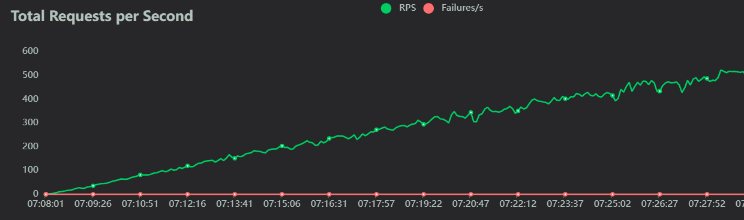
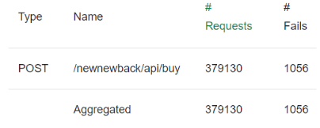
gatner를 통해 확인된 애플리케이션 평균 실패율이 0.5%였으므로 이보다 낮은 수치인 0.278%는 안정성 검증 성공이라고 봤습니다. 노드와 파드의 오토스케일링 역시 모두 이상 없이 진행되는 모습을 확인할 수 있었죠.

### CI/CD
CICD의 경우 다음 dev 아키텍처 설계에서 볼 수 있듯이 GitOps Pipeline을 이용하였습니다.
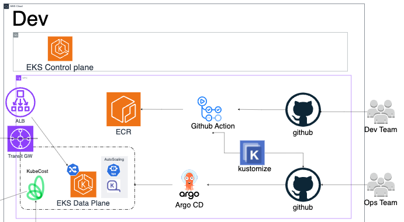

dev 팀이 Application code를 github에 푸시하면 github action을 통해 빌드됩니다. 이후 이미지는 자동으로 Amazon ECR에 푸시되며 운영팀의 manifest code github에 그 최신 이미지의 태그값이 kustomize를 통해 자동으로 변경되어 커밋되죠. 이는 곧바로 argocd에 동기화되며 cicd 과정이 이루어지게 되는 것입니다. 이때 manifest code github에는 운영팀의 코드들이 들어있습니다. 즉 배포와 관련된 코드들이 담겨있는 것이죠. 정리하고 보니 특별할 것 없는 과정이지만 처음 담당해 보는 부분이라 여러 시행착오가 있었습니다. 처음에는 생각보다 애를 먹었죠. 그러나 많은 트러블 슈팅을 거듭해 성공하는 과정을 겪고 나니 앞으로는 쉽게 할 수 있을 것 같다는 자신감이 생겼습니다. 이제 cicd pipeline은 걱정이 없을 것 같네요.🤣
 
배포 전략의 경우는 블루그린 배포 방식을 채택했습니다. 배포 전략의 경우도 여러 가지 중에 고민을 했었습니다. 특히나 rolling update나 canary, bluegreen 중에 고민했었죠. 특히나 배포 전략의 경우 전적으로 제 선택과 결정에 달려있는 일이었기에 더 신중하게 생각해야 했습니다. 결국 블루그린 방식을 채택하게 된 것에는 다음과 같은 이유가 있습니다. 

1. 서비스를 제공 중인 애플리케이션에서 업데이트 작업이 일어나지 않아 다운타임이 없다.
2. 장애가 발생하더라도 즉시 롤백이 가능하다.
3. 따라서 운영 환경에 영향을 주지 않아 고가용성과 무중단을 유지할 수 있다.

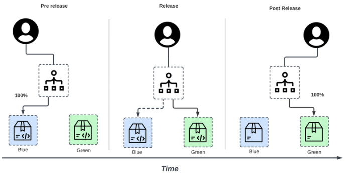

### 모니터링
모니터링의 경우에도 여러 가지 도구 중에 고민하다가 Datadog으로 결정했습니다. 데이터독의 경우 CloudWatch나 Prometheus, Grafana와 비교하여 몇 가지 이점이 있다고 판단했습니다. 다음이 그 이점입니다.
- 클러스터의 세부 정보 제공
- 엔터프라이즈 적합
- 비즈니스 모니터링 제공
무엇보다 가장 중요한 점은 현재 올리브영이 Datadog Best Practice 사례로 소개될 만큼 잘 사용하고 있다는 점입니다. 이는 프로젝트의 연계성을 고려했을 때 적절한 방안이라고 생각되어 Datadog을 모니터링 툴로 최종 선정하게 되었습니다.
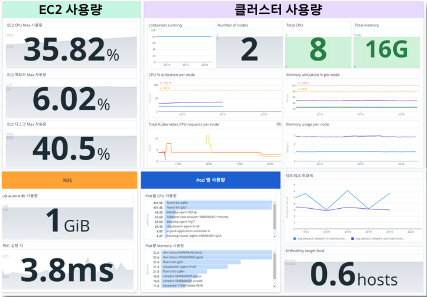
실제 대시보드를 구성하여 리소스를 모니터링하도록 했고 사용량과 지연속도에 기반해 항목별 알림 전송 기준을 설정했습니다. 팀 슬랙에 알림이 오는 것도 확인 가능했죠.
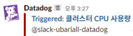

### 데이터 수집 파이프라인
실시간 데이터 수집 파이프라인의 경우 구매 요청이 API Gateway를 통해 들어오면 Lambda > Kinesis Data Stream > Kinesis Firehose > Elastic Cache Redis > S3의 순서로 데이터를 수집하고 가공합니다. 
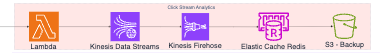
Kinesis의 경우 Kafka 대비 운영 복잡도가 낮다는 장점이 있어 선택하게 되었습니다. 
이후 데이터 수집 파이프라인의 성능 테스트 결과 약 37만 개 이상의 데이터가 Kinesis를 통해 실시간으로 수집되는 것을 확인 가능했습니다. 다음은 그 결과를 데이터독을 통해 물품별로 데이터를 분류한 결과입니다.
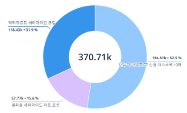
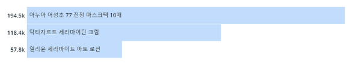

### 비용 절감 방안
비용 절감의 방안으로는 다음과 같은 것들을 고려했습니다. 
- kube-downscaler
- KEDA
- Karpenter
- Kubecost 
 
kube-downscaler를 사용하면 유휴 자원을 최소화할 수 있습니다. production 서버는 상시 돌아가야 하지만 이를 제외한 개발이나 검증 서버는 퇴근시간대와 같은 잘 사용하지 않는 시간대에 유휴 자원을 최소화하여 비용 최적화를 실현할 수 있습니다.
KEDA의 경우 이러한 상황뿐만 아니라 대형 이벤트를 준비하는 경우에 워커 노드의 수를 미리 늘려 놓는 등의 상황에 적합합니다. 
Kubecost를 활용하면 비용 절감의 기준을 확정할 수 있을 것이라 판단했습니다. Kubecost의 경우 다음과 같은 기능을 가집니다.

- Kubernetes의 각 리소스별 비용 가시성 확보
- 비용 최적화 Insight 제공
- 실제 사용 리소스 별 상세 비용 제공
- 예산 설정 및 알림 기능 제공 

모든 기능을 다 사용해보지는 못했지만 해당 프로젝트에서는 비용 절감의 기준을 확정하는 것만으로도 의미가 있다고 생각했죠. 기존 AWS의 cloud billing 비용 보고서를 사용해 보았을 때, Kubernetes의 pod나 node 등 상세 리소스별 비용을 파악하기 어려웠습니다. 이를 극복하기 위해 쿠버네티스의 리소스별로 기존 성능기반 아주 상세한 비용을 알려주어 FinOps에 최적화된 도구, Kubecost를 사용하게 된 것입니다.
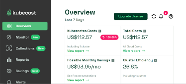

## 프로젝트를 마무리하며
해당 프로젝트 내에서 사용한 AWS의 서비스들은 모두 중동 리전에서 사용이 가능합니다. 따라서 향후 올리브영이 중동 사업을 본격적으로 확장한다면 충분히 참고 가능한 내용이라고 생각했습니다. 물론 학생 수준이라 전문가가 보기에는 미흡하겠지만요. 프로젝트를 마무리하면서 들었던 아쉬움 중 하나는 직접 중동 리전에 모든 인프라를 구축해보지 못한 점인 것 같습니다. 실제로 프로젝트 평가가 끝나고 받았던 피드백 중에서 직접 중동 리전에 구현했었으면 무조건 1등이었을 거라는 피드백도 있었습니다. 그래서 그 부분이 더 아쉬움으로 남는 것 같아요. 또 하나 들었던 아쉬움은 KDS를 통해 수집한 데이터를 가공해서 조금 더 다양한 기능을 넣을 수 있었으면 좋았을 텐데 하는 아쉬움이 남습니다. 전체적으로 시간이 부족했어서 진행하지 못한 부분이라 더 아쉬움이 남네요. 
그러나 아쉬움만 남는 것은 아닙니다. 초기 계획에 모든 부분을 달성한 것은 아니지만 어쨌든 목표로 했던 굵직한 서비스들은 모두 구현하는 것에 성공했습니다. 다소 짧은 시간 동안 많은 것들을 다루고 고민하고 설계하느라 팀원들 모두 고생했었죠. 함께 고생하면서 느꼈던 것 중 하나는 팀원분들이 모두 너무 좋은 분들이라는 것이었습니다. 이런 팀원들 아니었으면 제가 이렇게 끝까지 잘 해낼 수 있었을까 하는 생각이 들 정도로요. 다들 배울 점이 너무 많은 분들이셨고 실제로 많이 배워가려고 노력한 것 같아요. 일을 대하는 자세나 평소 생활 습관이나 열정 그리고 실력 등 본받고 싶은 것들이 많았어서 더 의미 있었던 것 같습니다. 팀이 전체적으로 분위기도 너무 좋았고 당연하에 역할 분담도 잘 되어있었네요. 팀워크라는 게 얼마나 중요한 것인지 잠시 잊고 있었는데 너무 좋은 분들과 팀을 이뤄서 힘든 프로젝트를 진행하고 나니 다시금 깨달았습니다. 
막연히 그냥 인프라를 생각했을 때는 그 안정성이 얼마나 중요한 것인지 잘 체감이 안되는데 이번 프로젝트에서 올리브영을 다루고 나니 그 중요성이 아주 크게 다가왔던 것 같습니다. 올리브영 세일 기간에는 저도 많이 물건을 구매하는데 그 트래픽량을 조사하다 보니 상상 그 이상이었습니다. 당장의 소비자 입장에서 생각해 봐도 올리브영 세일 중에 물건을 구매하려 했는데 무엇인가 문제가 발생한다거나 늦어진다거나 하면 꽤나 큰 일일 것 같습니다. 하물며 운영하는 운영자 입장에서는 더 큰일이겠죠. 안정적인 인프라를 강조하는 게 괜히 그런 것이 아니라는 것을 분명하게 느낄 수 있었습니다. 기업의 입장에서는 안정적이되 마냥 비용을 들일 수 없으니 더 힘든 일일 것 같습니다. 그런 부분들을 모두 고려해 보는 과정 속에서 머리도 많이 아프고 힘들었지만 모순적이게도 그게 너무 재미있었습니다. 팀원들과 회의 진행하며 이런저런 당위성을 고려해 보는 과정도 흥미로웠던 것 같아요. 앞으로 더 공부하고 프로젝트하고 싶어 졌습니다.

