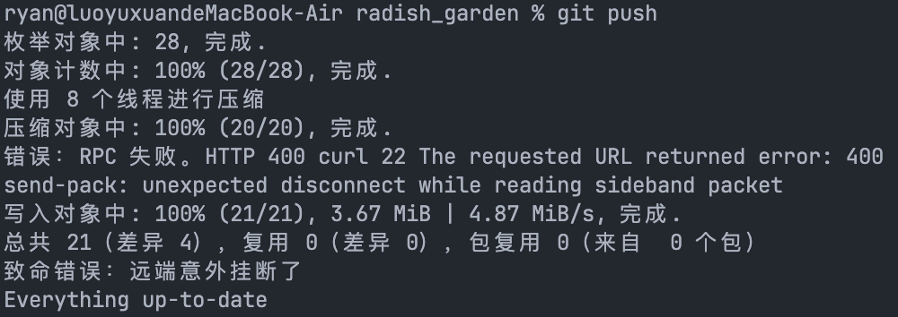

# git push 出错解决

最近在提交代码的时候遇到了以下错误



在网上尝试各种方法，包括设置git代理等，最后在这个[stack overflow帖子](https://stackoverflow.com/questions/78866739/how-to-fix-git-error-rpc-failed-http-400-curl-22-permanently)找到了解决方案

```shell
git config --global http.postBuffer 524288000
```

即永久设置git缓冲区大小为500MB